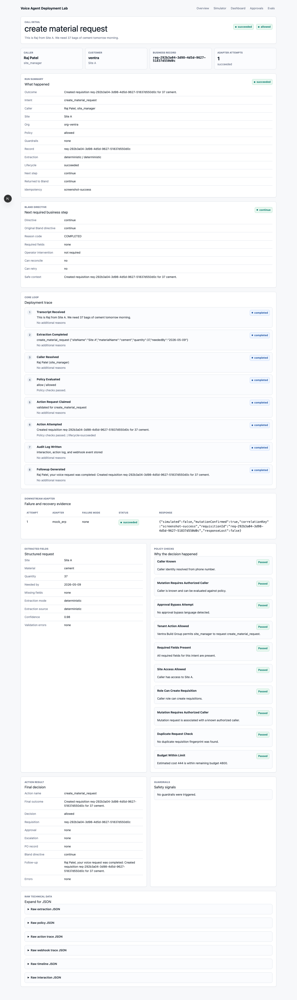

# Voice Agent Deployment Lab (VoiceLab)

Bland handles the conversation. VoiceLab governs whether that conversation can become a real business-system side effect, executes or gates it safely, and returns the policy-derived next required step.

The domain is a construction ERP (material requests, stock, purchase orders, vendor payments, site issues). The ERP is a mock.

**External verification:** the current hardened VoiceLab V2 was verified through a real Bland Console Tools / Custom API execution with authenticated webhook handling and Neon-backed persistence. Bland called a temporary public deployment with `x-bland-webhook-secret`, got `status=success`, created a requisition in Neon, and an identical replay returned the same requisition without creating a duplicate. The temporary Bland, Vercel, and Neon resources were deleted afterwards. Older evidence also records a real Bland Webhook-node call against an earlier V2 build. Not verified: live phone calls, full Pathway conversational routing, Bland Agent Testing, a real ERP, production traffic, or a maintained public deployment. Evidence and its limits: [docs/external-evidence/](docs/external-evidence/README.md).



## The boundary

| Bland owns | VoiceLab owns |
|---|---|
| Telephony, the conversation, asking follow-up questions | Structured request validation, caller identity, deterministic policy, approvals |
| Extracting variables from speech | Idempotent, safe writes; reconciliation; audit |
| How to phrase things to the caller | What business state is required next, returned as `next_step.directive` |

`next_step.directive` is one of `continue`, `clarify`, `await_approval`, `handoff_to_human`, `retry_later`, `reconcile`. It is computed from internal state by one function ([lib/actions/next-step.ts](lib/actions/next-step.ts)); nothing upstream can set it.

## Decisions this project is built around

- **LLMs extract; they never authorize.** Upstream fields (`authorized`, `approval_required`, role claims, inferred values) cannot change a decision. Caller identity comes from a phone lookup, and policy is deterministic code plus per-customer config.
- **Missing data: clarify first**, hand off to a human if clarification is impossible, and never infer required facts.
- **Reads may retry. Writes retry only when VoiceLab knows the earlier attempt did not mutate anything.**
- **Unknown outcome means reconcile before retry.** See below.
- **No generic bypass.** Higher authority exists only where a customer's config grants it. Operators can approve, reject, reconcile, and retry when safe. There is no "ignore policy and execute".
- **Customers differ in data, not code:** allowed sites, role permissions, finance visibility, approval limit. Two are seeded (Ventra, Northstar). An unknown or missing customer key on the webhook fails closed; there is no fallback tenant.
- **Idempotency is checked against the request, not just the key.** Same key and same request replays. Same key and a different request is refused and handed to a human.

## The hardest case: mutation succeeds, response lost

1. VoiceLab sends a write to the downstream system; the write happens, the response never arrives.
2. The action becomes `reconciliation_required` and Bland is told `reconcile`. Retry is refused.
3. Reconciliation asks the downstream whether a mutation with our correlation key exists. The caller cannot supply the answer.
4. Found: the action is `recovered` and no second write happens. Not found: retry becomes allowed. Downstream unavailable: `human_review_required`.

Every step is recorded as an adapter attempt and audit row, and shown in the call trace. The lost response is simulated (the mock ERP performs the write and then hides the result); the lifecycle, the refusal to retry, the lookup, and the audit trail are real code paths.

## What is real and what is simulated

| Real | Simulated |
|---|---|
| Webhook auth, policy, tenant config, idempotency, approvals, reconciliation state machine, audit, `next_step` | The ERP (rows in the same database) and its failure modes |
| Neon/Postgres persistence and unique-index idempotency (in-memory fallback for local runs) | Follow-up messages (stored, not sent) |
| Real Bland Console Tools / Custom API execution against the hardened runtime; older real Webhook-node evidence (see evidence) | Phone calls: none were placed |

## Run it

```bash
npm install
cp .env.example .env.local
npm run dev            # http://localhost:3000, in-memory data unless DATABASE_URL is set
npm test               # unit and integration tests
npm run eval           # 50 scenarios, deterministic policy regression
npm run verify:trace   # decision timeline report
npm run lint && npx tsc --noEmit && npm run build
```

`npm run eval` reports `50/50` and `0 unsafe actions`. That is a **deterministic policy regression** over scripted scenarios: it says the policy engine still behaves as specified, not that a model, a conversation, or a live deployment is reliable. Reconciliation, approvals, tenant differences, and the `next_step` contract are covered by the Vitest suite rather than the eval scenarios.

Postgres is optional: set `DATABASE_URL` and run `npm run db:push`. Resetting a configured database (`db:seed`, `verify:db`, or any test or eval run against it) is refused unless `ALLOW_DESTRUCTIVE_DB_RESET=1`; use a disposable database.

## Configuration

| Variable | Purpose |
|---|---|
| `BLAND_WEBHOOK_SECRET` | Value Bland sends in the `x-bland-webhook-secret` header. Required in production; the only accepted auth mechanism. |
| `OPERATOR_API_SECRET` | Value for the `x-operator-secret` header on approve, reject, reconcile, retry, `/api/demo/*`, and `/api/actions/*`. Unset: open locally, 403 in production. |
| `DATABASE_URL` | Postgres. Unset: in-memory. |
| `EXTRACTION_MODE`, `OPENAI_*` | Optional LLM extraction. Deterministic by default; LLM output is validated and cannot authorize. |

## Known limitations

- Operator routes are protected by one shared secret, not user authentication. Audit rows record the synthetic actor `demo_operator`.
- The webhook secret is shared across customers and `customer_key` selects the tenant; per-tenant secrets are not implemented. Non-webhook callers that supply no customer key get the seeded demo tenant (Ventra).
- The read-only UI pages (dashboard, call detail, approvals list) are unauthenticated; only the mutating routes are protected.
- Approval expiry is not implemented. An action that dies mid-`executing` needs manual intervention.
- Idempotency covers the modelled workflows, not exactly-once delivery in general. A negative reconciliation lookup is only as trustworthy as the downstream's read consistency.
- No public deployment is maintained; the temporary one used for verification was deleted.
- Deterministic extraction handles the scripted phrasings. Messy real transcripts are left to Bland's variable extraction, which is untested here.

## More

- [docs/PRD_V2.md](docs/PRD_V2.md) and [docs/PRE_BUILD_DECISIONS.md](docs/PRE_BUILD_DECISIONS.md): scope and locked decisions
- [docs/Bland-integration.md](docs/Bland-integration.md): webhook contract and pathway setup
- [docs/security-and-safety.md](docs/security-and-safety.md): threat model, idempotency, reconciliation, route protection
- [docs/demo-script.md](docs/demo-script.md): 90-second walkthrough
- `lib/actions/action-gateway.ts` is the single orchestration path used by the simulator, demo route, webhook, evals, and trace verification.
