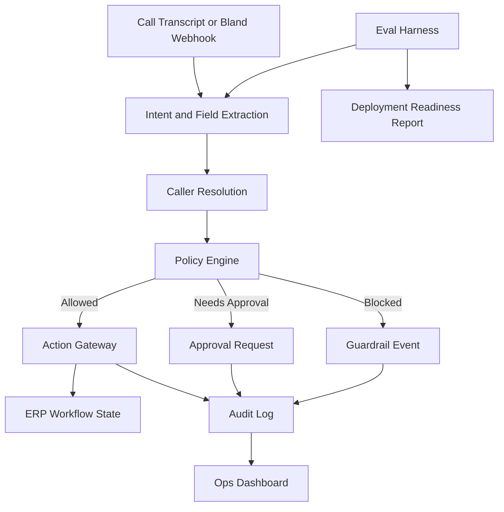

# Voice Agent Deployment Lab

A production-style implementation harness for deploying enterprise voice agents into real business workflows with typed webhooks, RBAC, policy checks, audit logs, approvals, and regression evals.

## Why this exists

Most voice AI demos stop at conversation. This project focuses on the layer after the demo: safely connecting a voice agent to customer systems where actions have consequences.

The demo uses a construction ERP workflow as the customer system. Callers can request materials, check stock, ask about purchase orders, check vendor payment status, or escalate urgent site issues. The system resolves caller identity, validates permissions, extracts structured intent, runs guardrails, and either executes a safe backend action or routes the request to approval.

## What the demo shows

- Voice-agent-style workflow orchestration
- Typed webhook/action gateway
- Caller identity resolution
- Org/site-scoped RBAC
- Policy enforcement before mutation
- Audit logs and decision traces
- Approval routing for unsafe or over-budget actions
- WhatsApp/SMS-style follow-up summaries
- Regression evals for deployment readiness

## Architecture



## Core workflows

1. Create material request
2. Check stock
3. Check PO status
4. Check vendor payment status
5. Report urgent site issue

## Action gateway

All voice-triggered actions pass through typed endpoints:

```txt
POST /api/actions/resolve-caller
POST /api/actions/extract-intent
POST /api/actions/check-stock
POST /api/actions/check-budget
POST /api/actions/create-requisition
POST /api/actions/request-approval
POST /api/actions/check-po-status
POST /api/actions/check-vendor-payment
POST /api/actions/escalate-site-issue
POST /api/actions/send-followup
POST /api/demo/run-scenario
```

Each endpoint uses:

- Zod request and response schemas
- Org/site scoping
- RBAC checks
- Idempotency keys for write actions
- Audit logs
- Structured error codes

## Policy engine

The policy engine decides whether an action is allowed, blocked, clarified, or routed to approval.

Rules include:

- Unknown callers cannot mutate data
- Users can only act within allowed sites
- Missing required fields trigger clarification
- Over-budget requests route to approval
- Duplicate material requests are detected
- Finance information is role-restricted
- Attempts to bypass approval are blocked and logged
- Urgent issues escalate immediately

## Eval harness

Run:

```bash
npm run eval
```

The eval harness runs scenario files from `/eval/scenarios` and generates:

- `docs/eval-results.md`
- `docs/deployment-readiness-report.md`

Metrics tracked:

- Intent accuracy
- Field extraction correctness
- Action correctness
- Guardrail correctness
- Unsafe action rate
- Clarification handling
- Duplicate prevention
- Approval routing correctness

## Local setup

```bash
npm install
cp .env.example .env.local
npm run db:push
npm run db:seed
npm run dev
```

## Environment variables

```txt
DATABASE_URL=
BLAND_API_KEY=
BLAND_WEBHOOK_SECRET=
NEXT_PUBLIC_APP_URL=
```

Bland integration is optional. Simulator mode should run without external API keys.

## 90-second Loom script

1. Explain the project in one sentence.
2. Run a valid material request scenario.
3. Show caller resolution, extracted fields, policy result, and created requisition.
4. Run an over-budget or unauthorized scenario.
5. Show blocked/routed action and guardrail reason.
6. Show eval report and deployment readiness summary.
7. End with the point: this is the deployment layer that makes voice agents safe enough to touch business workflows.

## How this maps to forward deployed voice AI work

This project models the work required to deploy a voice agent inside a customer environment:

- Map messy operational workflows into agent actions
- Integrate with customer APIs and databases
- Design safe webhook contracts
- Enforce business rules outside the LLM
- Test edge cases before deployment
- Produce observability and deployment reports

## Known limitations

- Simulator mode uses deterministic extraction unless external LLM/Bland mode is configured.
- The demo domain is construction ERP, not a full production ERP.
- SMS/WhatsApp follow-ups can be mocked in v1.
- Real Bland phone routing is optional for the first release.

## Next steps

- Add real Bland pathway import/export
- Add real Twilio/WhatsApp delivery
- Add versioned deployment configs
- Add replay tools for failed eval scenarios
- Expand scenario coverage from 30 to 50+
